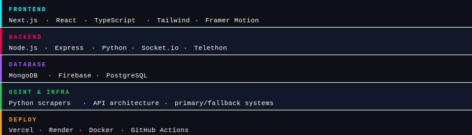

 

 

> *building tools that matter — osint, ai systems, and developer utilities.*
> *full stack dev from noida. crafting experiences through intelligence and code.*

 

<!-- TABLE-START --><!-- Last updated: 2026-03-15 05:51:14 UTC -->

  <table style="border: 1px solid #00f3ff; border-radius: 0px; background: #0d1117; width: 80%; box-shadow: 0 0 12px #00f3ff50;">
    <tr style="border-bottom: 1px solid #00f3ff;">
      <td colspan="2" style="padding: 8px; background: #111827; color: #00f3ff; font-family: monospace; font-size: 12px;">
        lazyekansh @ github :: ~/status
      </td>
    </tr>
    <tr>
      <td align="center" style="padding: 20px; border-right: 1px solid #00f3ff; width: 40%; vertical-align: middle;">
        
          
        <code style="color: #00f3ff;">shipping daily. no days off.</code>
      </td>
      <td align="left" style="padding: 20px; font-family: 'Courier New', monospace; color: #ffffff;">
        <strong style="color: #00f3ff;">// system_metrics</strong>  
        streak_active :: <code style="color: #00f3ff;">13 days</code> 
        total_commits&nbsp;&nbsp;:: <code style="color: #00f3ff;">2072</code> 
        current_year&nbsp;&nbsp;&nbsp;:: <code style="color: #00f3ff;">2026</code> 
      </td>
    </tr>
  </table>

<!-- TABLE-END -->

 

feel free to poke around my projects — most are open experiments. always down to collab, so if you've got an idea, let's ship it.

 
 

 
 

---

###  things i've shipped

 

 
 

---

###  stack

 

 

---

###  chess

 

 

---

noida, india · born nov 26' 2009 · building since forever

